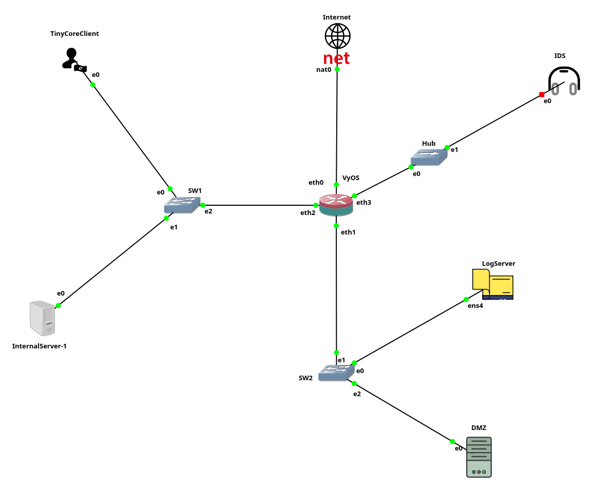

# IT Security Lab Environment – GNS3 Project

This repository documents a simulated enterprise network environment built in GNS3. The project is designed to demonstrate broad IT security skills relevant for a generalist role, including network segmentation, intrusion detection, log centralization, and firewall configuration.

## Overview

The lab consists of multiple virtual machines, interconnected through virtual switches and routers, with clearly separated network zones and realistic services. This environment is intended to replicate the architecture and challenges of a small-to-medium enterprise network.

## Lab Architecture

- Firewall Router: VyOS 1.4 (Sagitta)
- Demilitarized Zone (DMZ): Web server and log server
- Internal Network: Internal client and internal server
- IDS Node: Suricata-based intrusion detection on mirrored DMZ traffic
- Log Server: Debian 12 with rsyslog configured to receive logs over UDP
- Internet Access: GNS3 NAT node connected via firewall
- Switching: Virtual Ethernet switches for each network zone
- Manual test client: TinyCore Linux (for traffic simulation)

## Network Segmentation

The environment is logically segmented into three primary network zones:

| Zone        | Subnet (sanitized) | Devices                        |
|-------------|---------------------|---------------------------------|
| Internal    | 30.0.X.0/24         | Internal client and server      |
| DMZ         | 30.0.Y.0/24         | Web server, log server          |
| WAN (NAT)   | DHCP                | VyOS uplink to GNS3 NAT         |

*Note: All IP addresses have been sanitized and do not reflect real or routable addresses.*

## Security Features

- Stateful firewall and NAT implementation via VyOS
- Suricata IDS in passive (sniffing) mode on mirrored DMZ traffic
- Centralized logging with rsyslog (UDP port 514)
- Manual interface configuration and segmentation
- Minimal OS builds for reduced attack surface

## Technologies Used

- GNS3
- VyOS 1.4 (Sagitta)
- Debian 12 (rsyslog)
- Ubuntu Server 22.04 / 24.04
- Suricata
- TinyCore Linux (CorePlus) — Lightweight test client, used for network verification and simulated user behavior

## Screenshots

_Example of the GNS3 topology:_



_Include images of Suricata alerts and log server output as appropriate._

## Objectives

- Demonstrate secure network segmentation and firewall policy design
- Detect basic network-level intrusions via IDS
- Centralize log collection from multiple sources
- Simulate enterprise-like network challenges and defense mechanisms

## Usage Examples

### Sending a test syslog message from TinyCore Linux using netcat

```bash
echo "<13>Test: Syslog test from Internal-Client" | nc -u -w1 10.0.2.20 514
```

This message is received and written to `/var/log/remote.log` on the log server. The test script can be found at:

```bash
scripts/rsyslog-test.sh
```

## Future Enhancements

- Integrate Graylog or ELK stack for advanced log analysis
- Include VPN access to simulate secure remote connectivity
- Simulate external attacks using Kali Linux for blue-team training

## Repository Structure

```
/topology/
    current-topology.png
/configs/
    vyos-basic.conf
    rsyslog-udp-input.conf
    suricata.yaml
/scripts/
    rsyslog-test.sh
README.md
TROUBLESHOOTING.md
```
For common setup issues, see TROUBLESHOOTING.md.


